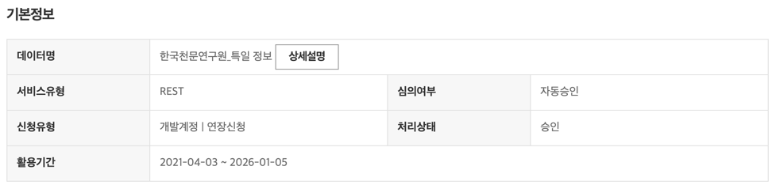
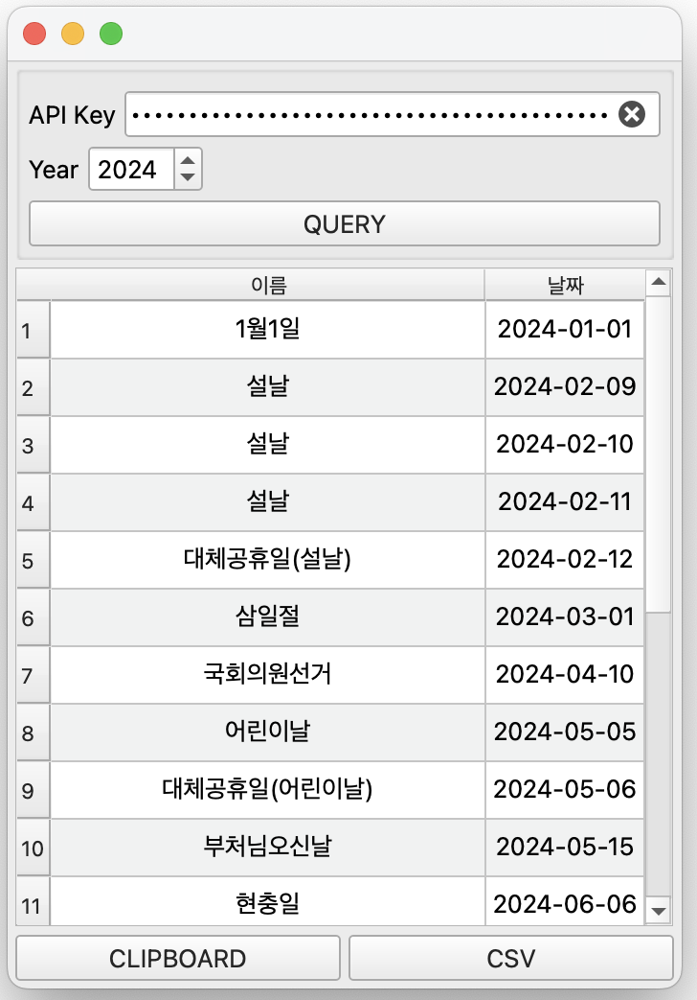

# Query Holidays Application
Query yearly holidays from `public data portal` (data.go.kr).<br>
Qt6(PySide6) is utilized as GUI platform.

Prerequisite
---
1. Acquire API key from public data portal<br>
    
2. Apply data usage (Link:[한국천문연구원_특일 정보](https://www.data.go.kr/tcs/dss/selectApiDataDetailView.do?publicDataPk=15012690)) <br>
    

Requirements
---
- Python 3
  - Recommended version: >= `3.10.x` (Tested on **3.10.11**)
  - If this application is not running on other versions, let me know
- Packages
  - PySide6
  - pandas
  - requests
    ```shell
    $ pip3 install -r requirements.txt
    ```

Run
---
```shell
$ python3 main.py
```
1. Enter API key and target year
2. Click `QUERY` button
    

Reference
---
Blog: [대한민국 공휴일 쿼리 어플리케이션 개발](https://yogyui.tistory.com/entry/Python%EB%8C%80%ED%95%9C%EB%AF%BC%EA%B5%AD-%EA%B3%B5%ED%9C%B4%EC%9D%BC-%EC%BF%BC%EB%A6%AC-%EC%96%B4%ED%94%8C%EB%A6%AC%EC%BC%80%EC%9D%B4%EC%85%98-%EA%B0%9C%EB%B0%9C-%EA%B3%B5%EA%B3%B5%EB%8D%B0%EC%9D%B4%ED%84%B0%ED%8F%AC%ED%84%B8)